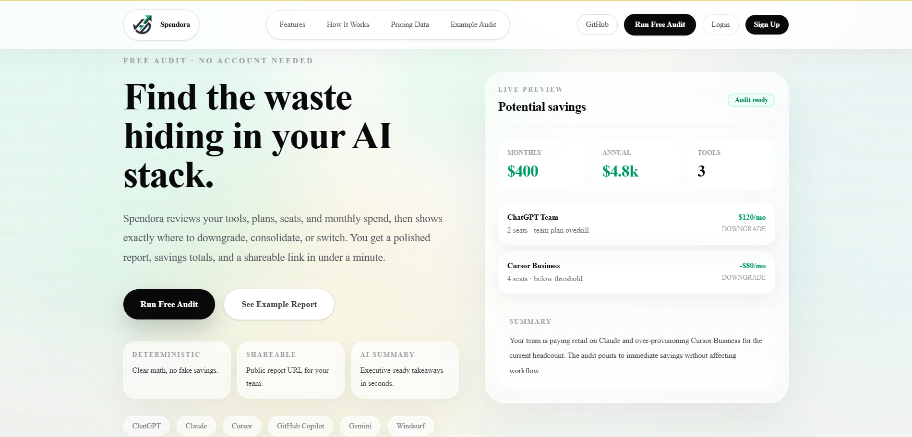
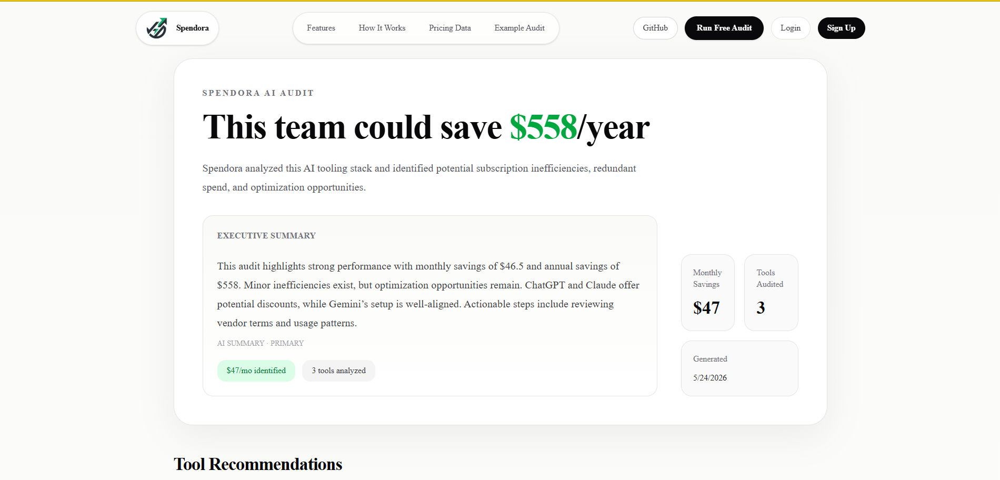
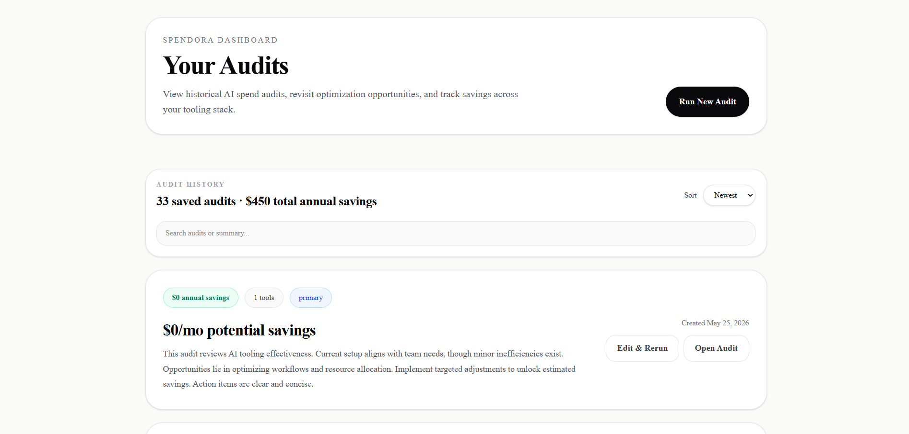

# Spendora

AI tooling cost optimization for modern teams.

Spendora analyzes AI subscription stacks, detects operational inefficiencies, estimates potential savings, and generates shareable audit reports for teams using tools like ChatGPT, Claude, Gemini, Cursor, Copilot, and Windsurf.

## Demo

Live App: https://spendora-aibuddy.vercel.app/

## Screenshots

### Landing Page



### Audit Report



### Audit Dashboard



## The Problem

AI tooling adoption inside startups and engineering teams has accelerated rapidly. Teams often subscribe to multiple overlapping products such as ChatGPT, Claude, Gemini, Cursor, GitHub Copilot, and Windsurf without clear operational visibility into usage efficiency or subscription overlap.

As AI tooling stacks grow:
- redundant subscriptions increase
- seat allocation becomes inefficient
- pricing structures become fragmented
- optimization opportunities become difficult to identify

Most teams currently manage AI spend manually through spreadsheets or finance reviews, which creates operational blind spots and unnecessary monthly costs.

## The Solution

Spendora provides a deterministic AI tooling audit system that:
- analyzes subscription configurations
- estimates optimization opportunities
- identifies overlapping tooling patterns
- generates executive summaries
- creates shareable audit reports
- enables authenticated audit history and persistence

The platform combines:
- deterministic pricing analysis
- operational heuristics
- AI-generated executive summaries
- persistent audit ownership

## Core Features

### AI Spend Audits

Analyze AI tooling stacks across products such as:
- ChatGPT
- Claude
- Gemini
- Cursor
- GitHub Copilot
- Windsurf

### Deterministic Pricing Engine

Spendora uses centralized pricing logic and threshold-based analysis to estimate:
- monthly savings
- annual savings
- operational inefficiencies

### AI Executive Summaries

Audit reports include AI-generated executive summaries with deterministic fallbacks for reliability.

### Authenticated Audit Ownership

Users can:
- create accounts
- save audits
- revisit historical reports
- manage previous optimization workflows

### Shareable Reports

Every audit generates:
- public URLs
- OG metadata
- social sharing previews

### Audit Dashboard

Authenticated users can:
- view historical audits
- reopen reports
- manage optimization history

### Lead Capture Workflow

Audit reports support:
- email sharing
- lead capture
- team collaboration workflows

## Architecture Overview

Spendora is built as a full-stack App Router application using:
- Next.js 16
- TypeScript
- Supabase
- OpenRouter
- TailwindCSS
- Jest
- Zod runtime validation

The architecture emphasizes:
- deterministic business logic
- thin API orchestration
- centralized pricing systems
- typed persistence
- authenticated ownership
- production-safe validation

For a deeper system walkthrough, see [ARCHITECTURE.md](./ARCHITECTURE.md).

## Request Lifecycle

```text
User submits audit
→ request validation
→ deterministic audit engine
→ AI summary generation
→ Supabase persistence
→ shareable report rendering
→ authenticated ownership (optional)


---

# TECH STACK

```md id="rm10"
## Tech Stack

### Frontend
- Next.js 16 App Router
- React
- TypeScript
- TailwindCSS

### Backend
- Route Handlers
- Supabase
- Zod validation
- Deterministic audit engine

### AI
- OpenRouter
- AI-generated summaries
- fallback summary pipeline

### Testing
- Jest
- Runtime validation tests
- API route tests
- Audit engine tests


---

# LOCAL DEVELOPMENT

```md id="rm12"
## Local Development

### Install Dependencies

```bash
npm install


### Start Development Server

```bash
npm run dev

### Run Quality Checks

```bash
npm run lint
npm run type-check
npm test
npm run build


---

# ENVIRONMENT VARIABLES

CRITICAL.

```md id="rm13"
## Environment Variables

Create a `.env.local` file:

```env
NEXT_PUBLIC_SUPABASE_URL=
NEXT_PUBLIC_SUPABASE_ANON_KEY=
SUPABASE_SERVICE_ROLE_KEY=

OPENROUTER_API_KEY=

RESEND_API_KEY=
FROM_EMAIL=


---

# PRODUCT DECISIONS

VERY HIGH VALUE SECTION.

```md id="rm14"
## Product Decisions

### Anonymous-First Onboarding

Users can run audits before authentication to reduce onboarding friction and improve conversion.

### Deterministic Audits Over Fully AI-Generated Analysis

Spendora prioritizes deterministic pricing logic for:
- consistency
- operational trust
- lower inference costs
- predictable outputs

AI is used only for executive summaries and enrichment.

### Centralized Pricing Architecture

All pricing logic is centralized in `pricing.ts` to avoid fragmented business rules and simplify maintenance.

### Thin Route Handlers

API routes are intentionally minimal and delegate business logic to isolated library modules.

## Stability & Verification

The project currently includes:
- 58 passing tests
- full TypeScript validation
- ESLint validation
- successful production builds
- authenticated persistence flows
- SSR-compatible App Router architecture

Verified flows:
- audit generation
- AI summary generation
- lead capture
- authenticated dashboards
- audit sharing
- audit ownership linking

## Future Improvements

Potential future improvements include:
- smarter recommendation reasoning
- recurring audits
- CSV exports
- analytics dashboards
- team workspaces
- richer overlap detection
- recommendation confidence tuning

## Reflection

The most difficult parts of the project were not UI implementation, but:
- authenticated ownership flows
- SSR-safe auth handling
- deterministic audit modeling
- runtime validation
- anonymous-to-authenticated state continuity

One major product insight from building Spendora was that recommendation trust and operational clarity matter significantly more than AI-generated complexity.

## License

MIT